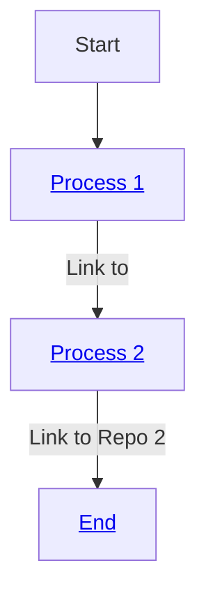
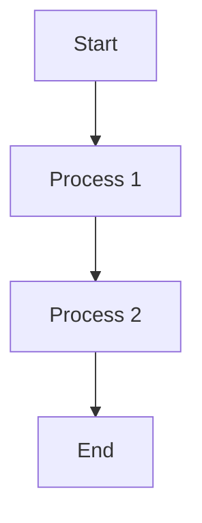

# Workflow Example

This document outlines the workflow using a flowchart.

```mermaid
graph TD;
    A[Start] --> B[Process 1] ;
    B[Process 1]-->|Link to [Repo 1](https://github.com/AlaaDiab7)| C[Process 2];
    C[Process 2] -->|Link to [Repo 2](https://github.com/wepe/MachineLearning)| D[End];
```

other attempt:

B[an <b>important</b> <a href='http://google.com'>link</a>]

---

another attempt:


<a href='http://github.com/AlaaDiab7'>Process 1</a>


Here is a simple flow chart:


