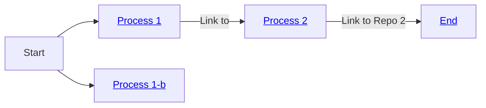
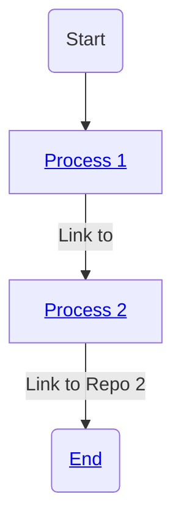

# Workflow Example

This document outlines the workflow using a flowchart.

---

other attempt:

---

another attempt:

<a href='http://github.com/AlaaDiab7'>Process 1</a>

Here is a simple flow chart:

